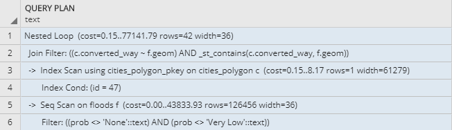

# Overview

My application displays regions of England. Most important features are:
- select a region of interest
- show floods probability for given region
- show hospitals in given region with information, wether they are endangered by a flood
- find the closest "safe" (not endangered by flood) hospital from selected hospital
- show route from endangered hospital to safe hospital 
- show basich statistics/info about displayed map-data 

The application has 2 separate parts, the client which is a [frontend web application](#frontend) using [leaflet.js](https://leafletjs.com/) and [jQuery](https://jquery.com/). The [backend application](#backend) is written in [Laravel](https://laravel.com/), backed by PostGIS. The frontend application communicates with backend using a [REST API](#api).

# Frontend

The frontend application is part of a Laravel application, and can be found in (`resources/views/welcome.blade.php`). It contains a .blade.php file with HTML code and javascript logic. At first, a user can see map in leaflet library, displaying [mapbox](https://www.mapbox.com/) map layer with England's regions. After clicking a region, map is zoomed to it and further information are retrieved from backend for given region.

After all floods and hospitals are displayed on the map, user can then select an endangered hospital (red ones) to get more detailed info. Particular flood points, which endangere selected hospital, are highlighted. User can also define, what distance from flood still endangeres any hospital. These "endangering circles" are drawn in red.

For given region also the closest safe hospital is found and a route to that safe hospital can be shown (if checkbox is checked). User can change safe zone diameter and then press the button to reload the map. Any time some data are being requested from server, loading screen is shown. When user finishes work with selected region, user can then select another region by clicking on it.

Front end code only displays data from backend ant takes care of data manipulation.

# Backend

The backend application is written in php in Laravel framework. Backend uses postgis and postgreSQL for data storage & manipulation. It only has 4 methods to get data from DB in `app/Http/Controllers/MapsController.php`.

## Database

There are 3 relevant tables in the database. It's `floods`, `cities_polygon` and `hospitals_polygon`, which are taken from `planet_osm_polygon`. I managed to find a suitable OSM data for whole England. The file is large but after some googling it could have been transformet and finally imported to postgis DB.

Information about floods are taken from [kaggle](https://www.kaggle.com/getthedata/open-flood-risk-by-postcode). There are separate points with lat/lon coordinates and flood probability for every point. Taking the fact, that England's region polygons are quite detailed and many, into consideration, I used ST_simplify function to speed up the map loading. All DB queries are written in Laravel's [Eloquent](https://laravel.com/docs/5.7/eloquent) RAW queries. The geometry data from DB is sent to FE using geojson format.

## Api

**Get all regions**

`GET /cities`

**Find floods for region**

`GET /floods/{cityId}`

**Find hospitals for region, returns also information if hospital is in danger of flood**

`GET /hospitals/{cityId}?safeZoneDiameter=[meters]`

**Find floods, which endager selected hospital**

`GET /floods-for-hospital?hospitalId=[id]&safeZoneDiameter=[meters]`

**Find closest hospital, which is not endagered by dangerous ("High" probability) flood**

`GET /closest-safe-hospital?hospitalId=[id]&safeZoneDiameter=[meters]&cityId=[id]`
### Response

API calls return geojson with geometry data, and additional information (such as count, distance, ...) if needed.

# Usecases

Here I describe usecases:

## UC1 Show flood probability for selected region
Filter those flood points, which are inside selected region. You can select region by clicking on it.  
Red circle - flood point with 'High' flood probability.  
Orange circle - flood point with 'Medium' flood probability.  
Blue circle - flood point with 'Low' flood probability.  

**Screenshot**  

**Query**

`SELECT ST_AsGeoJSON(geom), prob`  
`FROM floods as f JOIN cities_polygon as c ON ST_Contains(c.converted_way, f.geom)`  
`WHERE c.id = $cityId AND f.prob != 'None' AND f.prob != 'Very Low';`

**Explain**  
  

## UC2 Show hospitals for selected region and information wether they are endangered by dangerous flood.
Filter those hospitals, which are inside selected region and are endagered by flood, which has 'High' probabilty. Safe hospitals (which are not in selected radius from any dangerous flood) are shown as green, endangered hospirals are shown as red. Hospitals are inside a circle, so that they can be found more easily on the map.

**Screenshot**

**Query**

`WITH floods_in_city AS`  
&nbsp;&nbsp;&nbsp;&nbsp;`(SELECT f.geom AS flood_point, f.prob, f.id FROM floods as f`  
&nbsp;&nbsp;&nbsp;&nbsp;`JOIN cities_polygon as c ON ST_Contains(c.converted_way, f.geom)`  
&nbsp;&nbsp;&nbsp;&nbsp;`WHERE c.id = $cityId AND f.prob = 'High')`  
`SELECT DISTINCT ST_AsGeoJSON(h.converted_way) AS hospital, ST_DWithin(f.flood_point::geography, h.converted_way::geography, $diameter) AS endangered, h.id AS hospital_id`  
&nbsp;&nbsp;&nbsp;&nbsp;`FROM floods_in_city f RIGHT JOIN hospitals_polygon h`  
&nbsp;&nbsp;&nbsp;&nbsp;`ON ST_DWithin(f.flood_point::geography, h.converted_way::geography, $diameter)`  
&nbsp;&nbsp;&nbsp;&nbsp;`JOIN cities_polygon c ON ST_Contains(c.converted_way, h.converted_way)`  
&nbsp;&nbsp;&nbsp;&nbsp;`WHERE c.id = $cityId;`

**Explain**  
  

## UC3 Show dangerous flood points which endanger selected hospital and find closest safe hospital in selected region.
Filter those flood points, which are inside selected region and are endagering any hospital, and have 'High' probabilty. Also find closest hospitals in selected region, which are safe. Route to closest safe hospital is not done on DB level.  

**Screenshot**

**Query 1 - Find flood points**

`SELECT f.id as f_id, ST_AsGeoJSON(f.geom) AS flood_point_json FROM floods f`  
`JOIN hospitals_polygon h ON ST_DWithin(f.geom::geography, h.converted_way::geography, $diameter)`  
`WHERE h.id = $hospitalId AND f.prob = 'High';`

**Explain**  
  

**Query 2 - Find closest safe hospital**

`WITH tmp_floods AS `  
&nbsp;&nbsp;&nbsp;&nbsp;`(SELECT DISTINCT f.geom AS flood_point, f.prob, f.id`  
&nbsp;&nbsp;&nbsp;&nbsp;`FROM floods as f JOIN cities_polygon as c ON ST_Contains(c.converted_way, f.geom)`  
&nbsp;&nbsp;&nbsp;&nbsp;`WHERE c.id = $cityId AND f.prob = 'High'),`  
&nbsp;&nbsp;&nbsp;&nbsp;`tmp_hospitals AS (SELECT DISTINCT h.osm_id, h.converted_way, h.id FROM hospitals_polygon h`  
&nbsp;&nbsp;&nbsp;&nbsp;`JOIN cities_polygon c ON ST_Contains(c.converted_way, h.converted_way)`  
&nbsp;&nbsp;&nbsp;&nbsp;`WHERE c.id = $cityId),`  
&nbsp;&nbsp;&nbsp;&nbsp;`endangered_hospitals AS (SELECT DISTINCT h.id FROM tmp_floods f, tmp_hospitals h`  
&nbsp;&nbsp;&nbsp;&nbsp;`WHERE ST_DWithin(f.flood_point::geography, h.converted_way::geography, $diameter)),`  
&nbsp;&nbsp;&nbsp;&nbsp;`the_hospital AS (SELECT converted_way FROM tmp_hospitals WHERE id = $hospitalId)`  
`SELECT h.osm_id, ST_AsGeoJSON(ST_Centroid(h.converted_way)) AS closest_hospital, ST_AsGeoJSON(ST_Centroid(t.converted_way)) AS endangered_hospital, ST_Distance(h.converted_way::geography, t.converted_way::geography) AS distance`  
&nbsp;&nbsp;&nbsp;&nbsp;`FROM tmp_hospitals h, the_hospital t WHERE h.id NOT IN (SELECT id FROM endangered_hospitals) ORDER BY distance LIMIT 1;`

**Explain**  
  

